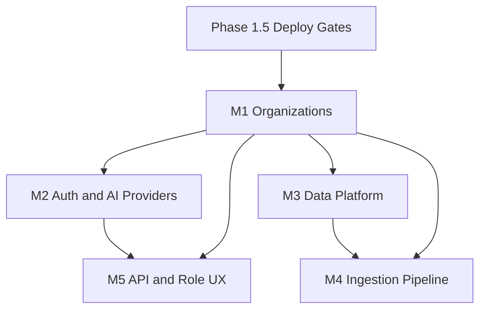

# Phase 2 Roadmap — Nexa Analytics AI Assistant

**Prerequisite:** Phase 1 RC (stabilization complete)  
**Vision:** Production-ready, multi-organization BI platform with pluggable data sources and AI providers  
**Planning date:** 2026-07-13

---

## Phase 1.5 — Deploy Gates (Recommended before Phase 2)

Short stabilization sprint to close critical debt without new product features.

| ID | Milestone | Debt items | Effort | Blocks |
|----|-----------|------------|--------|--------|
| 1.5.1 | Pin dependencies + CI | TD-005, TD-006 | 1–2 days | All Phase 2 |
| 1.5.2 | DNS-aware SSRF | TD-001 | 1–2 days | Public deploy |
| 1.5.3 | Anonymous session binding | TD-003 | 1 day | Public deploy |
| 1.5.4 | Production settings guard | TD-002 | 0.5 day | Public deploy |
| 1.5.5 | Deduplicate seed path constant | TD-017 | 0.5 day | — |

**Exit criteria:** CI green on every PR; SSRF test with mocked DNS; session hijack test for anonymous users; startup fails on insecure prod config.

---

## Phase 2 — Enterprise Foundation

### Milestone Overview

```
Phase 1.5 (gates)
       │
       ▼
  M1 ─ Organization & Data Isolation
       │
       ├──────────────────┐
       ▼                  ▼
  M2 ─ Auth & AI         M3 ─ Production Data Platform
  Provider Layer              (PostgreSQL, connectors)
       │                  │
       └────────┬─────────┘
                ▼
  M4 ─ Real Ingestion Pipeline
                │
                ▼
  M5 ─ API Platform & Role UX Completion
```

---

## M1 — Organization & Data Isolation

**Goal:** Support multiple organizations with isolated datasets, dashboards, and chat.

| Deliverable | Description |
|-------------|-------------|
| `Organization` model | Name, slug, settings JSON |
| `OrganizationMember` | User ↔ org with role (admin, analyst, viewer) |
| Scoped models | `DatasetUpload`, `DashboardState`, `ChatSession` gain `organization` FK |
| Middleware / context | Resolve org from subdomain, header, or user default |
| Migration | Backfill single default org for existing data |

**Dependencies:** Phase 1.5 complete (CI, session binding)  
**Effort:** 2–3 weeks  
**Debt addressed:** TD-008  
**Also fixes:** TD-012 (seed rename), TD-011 (date heuristics), TD-018 (org-scoped tests)

**Implementation order:** 1 (foundational — blocks M2–M5)

---

## M2 — Authentication, Authorization & AI Provider Layer

**Goal:** Secure API access and support multiple AI backends.

| Deliverable | Description |
|-------------|-------------|
| API authentication | Token or session auth on all `/api/*` endpoints |
| Rate limiting | Per-IP and per-org limits on chat + upload |
| `AIProvider` protocol | Abstract `chat()`, `generate_blueprint()`, `generate_brief()` |
| Adapters | NVIDIA (existing), OpenAI-compatible, optional local/Ollama |
| Org-level AI config | Provider + model + API key per organization (encrypted) |
| OpenAPI schema | `drf-spectacular` at `/api/schema/` |

**Dependencies:** M1 (org-scoped keys and limits)  
**Effort:** 2–3 weeks  
**Debt addressed:** TD-004, TD-010, TD-014, TD-015

**Implementation order:** 2 (parallel start possible after M1 data model lands)

---

## M3 — Production Data Platform

**Goal:** Move from SQLite demo to production-grade data storage and external connectors.

| Deliverable | Description |
|-------------|-------------|
| PostgreSQL app DB | Production `DATABASES` config; migration guide |
| Connector framework | `BaseConnector` interface in `data_sources.py` |
| Connectors v1 | PostgreSQL table (existing), Supabase REST, S3/URL scheduled pull |
| Connection credentials | Encrypted per-org storage |
| Dataset versioning | `DatasetUpload.version` + immutable snapshots |

**Dependencies:** M1 (org-scoped connections)  
**Effort:** 3–4 weeks  
**Debt addressed:** TD-007, TD-017

**Implementation order:** 3 (can overlap M2 after M1 week 1)

---

## M4 — Real Ingestion Pipeline

**Goal:** Replace ingestion stub with schedulable, observable data sync.

| Deliverable | Description |
|-------------|-------------|
| Task queue | Celery + Redis or django-q |
| `IngestionJob` expansion | Status machine: pending → running → success/failed |
| Scheduled sync | Cron per org connector |
| Retry + dead letter | Exponential backoff, admin visibility |
| Webhook trigger | POST `/api/ingestion/run/` enqueues real job |

**Dependencies:** M3 (connectors), M1 (org scope)  
**Effort:** 2–3 weeks  
**Debt addressed:** TD-009

**Implementation order:** 4

---

## M5 — API Platform & Role UX Completion

**Goal:** Polish integrator experience and complete role-based dashboard.

| Deliverable | Description |
|-------------|-------------|
| Widget renderer | Map `trend_summary`, `top_channels`, `campaign_actions` to UI sections |
| Insight XSS hardening | DOMPurify on insight cards |
| Audit log | Org-level event log (upload, blueprint change, chat) |
| Admin dashboard | Org usage, dataset list, job monitor |
| SDK / examples | Python + curl client examples in docs |

**Dependencies:** M1, M2  
**Effort:** 2 weeks  
**Debt addressed:** TD-013, TD-016, TD-018

**Implementation order:** 5

---

## Prioritized Implementation Order

| Order | Milestone | Duration | Cumulative |
|-------|-----------|----------|------------|
| 0 | Phase 1.5 gates | ~1 week | 1 week |
| 1 | M1 — Organizations | 2–3 weeks | 3–4 weeks |
| 2 | M2 — Auth & AI providers | 2–3 weeks | 5–7 weeks |
| 3 | M3 — Data platform | 3–4 weeks | 8–11 weeks |
| 4 | M4 — Ingestion pipeline | 2–3 weeks | 10–14 weeks |
| 5 | M5 — UX & API polish | 2 weeks | 12–16 weeks |

**Total Phase 2 estimate:** 12–16 weeks (1 developer), assuming Phase 1.5 complete first.

---

## Dependency Graph



---

## Success Metrics (Phase 2 Complete)

| Metric | Target |
|--------|--------|
| Organizations supported | ≥2 isolated tenants in staging |
| AI providers | ≥2 (NVIDIA + one other) |
| External connectors | ≥2 beyond file upload |
| Test count | ≥60 with CI coverage gate |
| API documentation | OpenAPI published |
| Production deploy | PostgreSQL + env secrets + SSRF closed |
| Ingestion | Scheduled job runs without manual trigger |

---

## Out of Scope for Phase 2

- Mobile native apps
- Real-time collaborative editing
- Custom SQL query builder
- Billing / subscription management
- SOC2 compliance audit

These belong to Phase 3 or dedicated workstreams.

---

## Recommendation

**Do not skip Phase 1.5.** M1 (organizations) is the critical path for everything else in Phase 2. Attempting M2 or M3 before org isolation will require a painful retrofit.

**Suggested kickoff:** Phase 1.5 sprint → M1 week 1 (org model + migration) → parallel M2 auth design + M3 connector interface.
