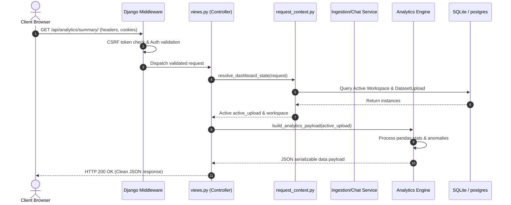
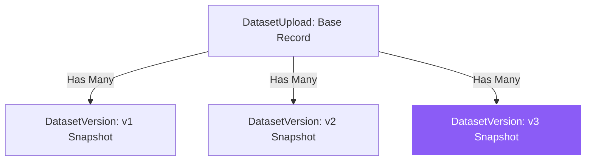
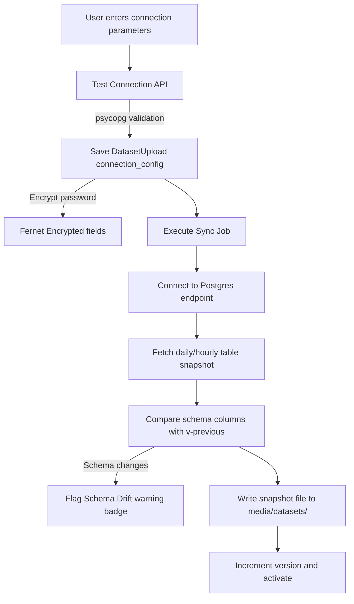
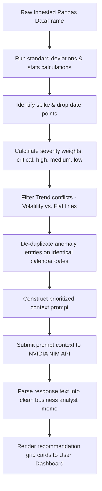

# System Design & Architecture

This document describes the core technical architecture, design patterns, lifecycle flows, pipelines, and schema mappings of Nexa Analytics AI.

---

## 1. Overall System Architecture

Nexa Analytics is organized around a classic clean layered architecture:

```
                  ┌──────────────────────────────┐
                  │       Client (Browser)       │
                  │ HTML · JavaScript · CSS · JS │
                  └──────────────┬───────────────┘
                                 │ HTTP / REST
                  ┌──────────────▼───────────────┐
                  │     Django View Layer        │
                  │ Thin controllers, Serializer │
                  └──────────────┬───────────────┘
                                 │
                  ┌──────────────▼───────────────┐
                  │        Service Layer         │
                  │ Ingestion, Chat, Encrypt API │
                  └──────────────┬───────────────┘
                                 │
                  ┌──────────────▼───────────────┐
                  │    Analytics/Engine Layer    │
                  │ KPI, Charts, Intelligent, PD │
                  └──────────────┬───────────────┘
                                 │
                  ┌──────────────▼───────────────┐
                  │          Data Layer          │
                  │ DatasetPipeline, SQL, Fernet │
                  └──────────────────────────────┘
```

---

## 2. Request Lifecycle

The following sequence details how client API requests resolve:



---

## 3. Dataset & Version Lifecycles

### Dataset Lifecycle States
Datasets transit through various states based on ingestion status and user interactions:

```mermaid
stateDiagram-RTL
    [*] --> Uploaded: User uploads File/URL
    Uploaded --> Processing: Ingestion starts
    Processing --> Processed: Validation green
    Processing --> Failed: Schema errors or SSRF block
    Processed --> Active: User selects/activates dataset
    Processed --> Archived: User clicks Archive
    Archived --> Processed: Unarchive toggle
    Processed --> Deleted: User deletes dataset
    Deleted --> [*]
```

### Dataset Version snapshotting
Versions are captured sequentially under the parent file header:


- **Incremental Bumps**: Uploading a new file to an existing dataset increments the version number index, snapshots the old path to a `DatasetVersion` entry, and overwrites the parent properties with the new payload.
- **Rollback Transitions**: Rolling back to version `v1` copies the blueprint and file attributes from the `v1` version record back to the parent `DatasetUpload` record.

---

## 4. Universal Connector Ingestion Flow

Connectors sync external endpoints to the local storage pipeline:



---

## 5. Intelligent Analytics Pipeline

Surfaces prioritized insights using deterministic math combined with generative summarizations:



---

## 6. Database Schema Overview

| Model | Primary Purpose | Key Fields | Relationships |
|---|---|---|---|
| **Organization** | Tenant boundary | `name`, `slug`, `settings_json` | Parent to members |
| **OrganizationMember** | User organization access role | `role` (owner/admin/analyst/viewer) | FK to User, FK to Organization |
| **Workspace** | Project workspace isolate shell | `name` | FK to owner User |
| **DatasetUpload** | Primary dataset asset | `stored_path`, `connection_config`, `active_version_number`, `insights_cache` | FK to Workspace, FK to Organization |
| **DatasetVersion** | Version snapshot | `stored_path`, `row_count`, `ai_blueprint`, `insights_cache` | FK to DatasetUpload |
| **DashboardState** | Client view persistence | `blueprint_override` | FK to DatasetUpload, FK to User |
| **UserProfile** | User parameters customization | `display_name`, `avatar`, `bio`, `timezone`, `theme_preference` | OneToOne to User |

---

## 7. Caching Strategy

- **Insights Caching**: Analytics payloads, anomalies, and AI summaries are cached inside the `insights_cache` field of `DatasetUpload` and `DatasetVersion`.
- **Cache Evacuation**: Resetting blueprints, running manual synchronizations, or rolling back versions invalidates the cache immediately, triggering a recalculation cycle on the next payload summary request.

---

## 8. Deployment & Security Architecture

### Security Controls
- **SSRF Mitigation**: Hostnames resolved via `socket.getaddrinfo` are checked against loopback, multicast, private RFC1918, and carrier-grade NAT address lists.
- **Symmetric Encryption**: Connection passwords are encrypted in-memory using Fernet key derivation backed by `settings.SECRET_KEY`.
- **Environment Safety**: Application boot throws a hard exception if `DJANGO_ENV` is set to `production` or `staging` while `DEBUG=True`.
